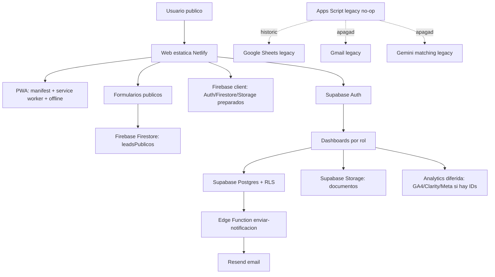

# ARCHITECTURE - ClasesDe10

Fecha de auditoria: 2026-06-16

## Resumen

ClasesDe10 es una web estatica desplegada en Netlify con una aplicacion privada
legacy sobre Supabase y una migracion activa a Firebase. La parte publica capta
demanda SEO y leads; la parte privada gestiona usuarios, profesores, familias,
alumnos, clases, pagos, documentos e incidencias. Existe ademas un sistema
historico en Google Sheets + Apps Script + Gemini que ya esta apagado como
sistema operativo.

Decision base: Firebase es la fuente de verdad objetivo. Firestore ya recibe
leads publicos y profesores importados. Supabase sigue temporalmente para Auth,
dashboards y operativa legacy hasta migracion por fases.

## Diagrama Logico

## Componentes

### Web publica

- Ubicacion: raiz de `web/`.
- Tecnologia: HTML/CSS/JS estatico, sin framework ni build step.
- Paginas principales: `index.html`, `como-funciona.html`, `para-padres.html`, `para-profesores.html`, `contacto.html`, `sobre-nosotros.html`, legales y SEO locales bajo `clases-particulares/`.
- Nav/footer: inline en paginas principales y `js/nav.js` en paginas SEO/legales.
- PWA: `manifest.json`, `service-worker.js`, `offline.html`, `js/pwa.js`.

### Aplicacion privada

- Ubicacion: `web/pages/`.
- Auth: Supabase Auth via `js/auth.js`.
- Dashboards: `admin`, `familia`, `profesor`, `alumno`.
- Utilidades: `js/utils.js`, `js/calendario.js`, `js/analytics.js`.
- Datos: Supabase Postgres con RLS.
- Documentos: Supabase Storage bucket `documentos`.

### Netlify

- Configuracion: `web/netlify.toml`.
- Publicacion: `publish = "."`.
- Dominio canonico: `https://clasesde10.com`.
- Redirecciones: `www` y `.es` a `.com`; aliases `/entrar`, `/registro`, `/dashboard`.
- Seguridad: CSP, HSTS, X-Frame-Options, noindex para auth/dashboards/offline.
- Bloqueo de archivos internos: docs, Supabase, generadores, ejemplos y configuraciones.

### Supabase

- Cliente anonimo publico legacy: `js/supabase-client.js`.
- Formularios publicos nuevos: `js/public-leads.js` -> Firebase Firestore.
- Configuracion publica compartida: `js/supabase-config.js`.
- Migraciones:
  - `001_schema_completo.sql`: modelo base.
  - `002_storage_policies.sql`: storage privado.
  - `003_fixes_produccion.sql`: vistas, grants y RLS de produccion.
  - `004_produccion_total.sql`: leads, invitaciones alumno, validaciones, mejoras de RLS.
- Edge Function: `supabase/functions/enviar-notificacion/index.ts`.
- Variables criticas: `SUPABASE_URL`, `SUPABASE_ANON_KEY`, `SUPABASE_SERVICE_ROLE_KEY`, `NOTIFICATION_SECRET`, `RESEND_API_KEY`.

### Google Sheets y Apps Script

- `clasp-project/main.js`: version remota segura no-op.
- `clasp-project/main.gs`: version legacy local previa, no operativa.
- `ClasesDe10-completo.gs`: duplicado exacto de `clasp-project/main.gs`.
- `matching-ia-gemini.gs`: modulo de matching IA anterior/aislado; la logica equivalente ya existe integrada en `main.gs`.
- Sheets legacy: `PROFESORES`, `FAMILIAS`, `ALUMNOS`, `CLASES`, `MATCHING LOG`, `RESUMEN MENSUAL`.
- Triggers legacy: lectura de Gmail cada 15 min, resumen mensual, matching IA semanal, `onEdit`.
- Estado: remoto sustituido por funciones no-op; no hay llamadas desde la web
  actual a Apps Script.

## Flujos de Datos

Docs ampliados relacionados: `ARCHITECTURE_FULL.md`, `SYSTEM_MAP.md`, `DECISION_MATRIX.md`, `FIVE_YEAR_ROADMAP.md`.

### Lead publico

1. Usuario rellena formulario publico.
2. `js/public-leads.js` valida y normaliza.
3. Inserta en Firestore `leadsPublicos`.
4. Admin revisa temporalmente en Firebase Console hasta migrar el panel.
5. Evento de analitica se dispara si hay IDs reales configurados.

### Registro y acceso

1. Usuario crea cuenta en `pages/registro.html`.
2. `js/auth.js` llama a Supabase Auth.
3. Trigger `handle_new_auth_user` crea perfil en `usuarios` y tabla de rol.
4. Login redirige al dashboard segun rol.

### Gestion de clases

1. Admin crea/asigna clases.
2. Profesor registra clases realizadas.
3. Trigger calcula comision/importes.
4. Familia/alumno/profesor consultan vistas filtradas por RLS.

### Documentos y pagos

1. Usuario sube archivo permitido al bucket `documentos`.
2. Se crea registro en `documentos`.
3. Admin valida o rechaza.
4. Visualizacion mediante signed URL temporal.

## Fuente de Verdad

| Dominio | Fuente de verdad |
| --- | --- |
| Usuarios, roles y sesiones | Supabase Auth + `usuarios` hasta migrar a Firebase Auth |
| Profesores | Firestore `profesores` para import limpio; Supabase en dashboards legacy |
| Familias/alumnos | Supabase Postgres hasta limpieza/import validado |
| Leads publicos | Firestore `leadsPublicos` |
| Clases, pagos, documentos | Supabase Postgres + Storage |
| Matching legacy | Google Sheets hasta migrar/apagar |
| SEO/publicacion | HTML estatico + sitemap |

## Principios de Arquitectura

- Mantener la web sin build hasta que haya necesidad real.
- Evitar dos fuentes de verdad activas.
- Centralizar datos nuevos en Firebase.
- Mantener Supabase solo como puente operativo hasta migrar dashboards/Auth.
- Mantener Apps Script cerrado y tratado como legado.
- No cachear rutas privadas en PWA.
- Documentar cualquier automatizacion antes de mantenerla o apagarla.
