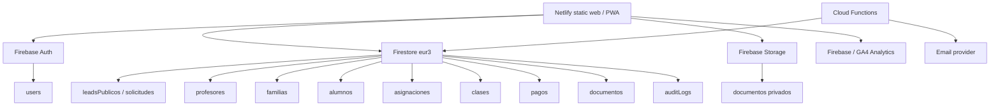

# FIREBASE_ARCHITECTURE - ClasesDe10

Actualizado: 2026-06-16

## Objetivo

Firebase sera la fuente de verdad final de ClasesDe10. Supabase queda como
puente operativo mientras se migran Auth, dashboards, documentos y datos
relacionales. Google Sheets y Apps Script quedan como archivo historico.

## Arquitectura definitiva

## Servicios Firebase

| Servicio | Uso | Estado |
|---|---|---|
| Firestore | Datos operativos y captacion publica | Vivo en `eur3` |
| Firebase Auth | Identidad y roles | Pendiente de inicializar |
| Firebase Storage | Documentos privados | Pendiente de inicializar |
| Cloud Functions | Notificaciones, antispam, automatizaciones | Pendiente |
| Analytics | Eventos web/PWA | SDK preparado |
| Hosting | Opcional futuro; Netlify sigue sirviendo la web | No prioritario |
| Crash Reporting | No aplica directamente a web; usar logs/monitoring | Futuro |

## Modelo Firestore objetivo

| Coleccion | Documento | Uso | Acceso |
|---|---|---|---|
| `users` | `{uid}` | Perfil base, rol, estado | Propio usuario y admin |
| `profesores` | `{uid}` | Perfil profesor privado/operativo | Profesor propietario y admin |
| `familias` | `{uid}` | Perfil familia privado/operativo | Familia propietaria y admin |
| `alumnos` | `{studentId}` | Alumno/hijo con `familyUid` | Familia, alumno, profesores asignados, admin |
| `solicitudes` | `{requestId}` | Solicitudes autenticadas de clases | Familia y admin |
| `leadsPublicos` | auto ID | Formularios publicos anonimos | Crear anonimo; leer/admin |
| `asignaciones` | `{assignmentId}` | Relacion profesor-alumno | Participantes y admin |
| `clases` | `{classId}` | Clase programada/realizada/cancelada | Participantes y admin |
| `pagos` | `{paymentId}` | Pagos, importes, validacion | Familia y admin |
| `documentos` | `{documentId}` | Metadata de Storage | Propietario y admin |
| `mensajes` | `{messageId}` | Comunicacion interna futura | Participantes y admin |
| `valoraciones` | `{reviewId}` | Feedback controlado | Participantes y admin |
| `incidencias` | `{incidentId}` | Soporte y problemas | Reportante y admin |
| `configuracion` | `{configId}` | Config privada | Admin |
| `configuracionPublica` | `{configId}` | Config visible | Lectura publica; escritura admin |
| `auditLogs` | `{logId}` | Auditoria operativa | Admin/backend |
| `importAudits` | `{auditId}` | Trazabilidad migraciones | Admin |
| `legacyImports` | `{docId}` | Indice de archivo historico | Admin |

## Roles

- `admin`: gestiona datos, profesores, familias, alumnos, clases, pagos,
  documentos, configuracion y logs.
- `profesor`: lee sus asignaciones, alumnos asignados y clases; actualiza perfil,
  disponibilidad y estado/notas de clases permitidas.
- `familia`: gestiona perfil familiar, alumnos propios, solicitudes, pagos y
  documentos.
- `alumno`: consulta sus clases, profesor asignado y materiales permitidos.

Decision: el rol canonico vive en `users/{uid}.role`. Las colecciones privadas
guardan `familyUid`, `teacherUid`, `studentUid` o mapas de participantes para
autorizar sin joins.

## Capa Auth frontend

`js/firebase-auth.js` ya existe como adaptador de transicion. Expone login,
registro, reset, logout, `requireAuth` y redireccion por rol con una forma
compatible con `js/auth.js`.

No se conecta aun a `pages/login.html`, `pages/registro.html`,
`pages/reset-password.html` ni dashboards porque Firebase Auth no esta
inicializado y aun falta crear el primer admin. Mantener Supabase en produccion
evita corte de acceso mientras Firebase se valida.

## Storage objetivo

| Ruta | Uso | Regla |
|---|---|---|
| `users/{uid}/...` | Documentos privados del usuario | Propietario o admin |
| `legacy-imports/...` | Archivos historicos Sheets/Apps Script | Solo admin |
| `public/...` | Assets publicos controlados | Lectura publica, escritura admin |

No se migran documentos hasta que Storage este inicializado y reglas desplegadas.

## Cloud Functions objetivo

| Funcion | Trigger | Motivo |
|---|---|---|
| `onLeadCreated` | `leadsPublicos/{id}` | Normalizar, puntuar, notificar y limitar spam |
| `onUserCreated` | Auth create | Crear `users/{uid}` minimo si procede |
| `sendNotification` | Callable/HTTPS | Email y notificaciones internas |
| `auditWrite` | eventos criticos | Trazabilidad |
| `scheduledBackups` | scheduler | Export/backup si el plan lo permite |

No se crean Functions hasta decidir plan/coste y tener Auth/Storage estables.

## Indices y costes

Principios:

- Mantener documentos pequenos y desnormalizados para reducir lecturas.
- Evitar subcolecciones profundas salvo historiales grandes.
- Consultas principales con filtros directos por `uid`, `estado`, `fecha`.
- No listar colecciones completas desde cliente salvo admin y con `limit`.
- Archivar logs antiguos fuera de colecciones calientes.

Indices ya preparados:

- `leadsPublicos`: `estado + createdAt`, `tipo + createdAt`.
- `alumnos`: `familyUid + active + createdAt`.
- `asignaciones`: `teacherUid + active + createdAt`.
- `clases`: `teacherUid + fecha`, `familyUid + fecha`.

Coste esperado inicial: bajo, dentro de Spark si se evita Storage/Functions con
alto trafico y se anade antispam antes de escalar leads anonimos.

## Seguridad

- Ninguna lectura anonima de datos privados.
- Leads anonimos solo permiten `create`, campos limitados, email valido y
  `metadata.consent_privacy = true`.
- Admin solo existe con documento `users/{uid}` y `role = admin`.
- Storage privado por `uid`.
- No service role ni claves privadas en frontend.
- CSP actual permite transicion; objetivo: eliminar inline JS y reducir
  `unsafe-inline`.

## Backups y observabilidad

- Firestore export gestionado cuando el plan/coste lo permita.
- `importAudits` documenta importaciones.
- `auditLogs` para acciones administrativas.
- Firebase Console para metricas iniciales; Cloud Logging cuando entren
  Functions.
- Search Console y PageSpeed siguen fuera de Firebase.

## Plan de migracion sin corte

1. Corregir SEO tecnico y documentacion.
2. Activar Firebase Auth Email/Password desde consola.
3. Crear primer admin en Auth y `users/{uid}`.
4. Migrar lectura/gestion de `leadsPublicos` al panel admin.
5. Migrar login/registro a Firebase Auth.
6. Migrar dashboards por rol: admin, familia, profesor, alumno.
7. Inicializar Storage y migrar documentos.
8. Sustituir Edge Functions Supabase por Cloud Functions.
9. Congelar Supabase en solo lectura.
10. Apagar Supabase cuando datos y flujos esten validados.
