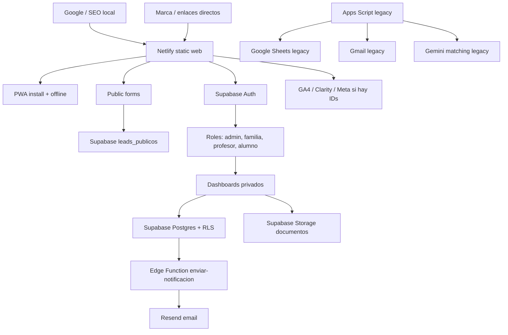

# SYSTEM_MAP - ClasesDe10

Actualizado: 2026-06-16

## Mapa logico

## Mapa de carpetas

| Ruta | Papel |
|---|---|
| `/web` | Aplicacion publicable |
| `/web/pages` | Auth y app privada |
| `/web/pages/dashboard` | Dashboards por rol |
| `/web/clases-particulares` | SEO programatico local |
| `/web/js` | Cliente Supabase, auth, analytics, PWA, utilidades |
| `/web/css` | Estilos publicos y dashboard |
| `/web/supabase` | Migraciones y Edge Function |
| `/clasp-project` | Apps Script legacy canonico |
| `/Versiones` | Zips historicos |

## Flujos de datos

| Flujo | Entrada | Proceso | Salida |
|---|---|---|---|
| Captacion familia | Formulario publico | Validacion JS + insert anon | Lead en Supabase |
| Captacion profesor | Formulario publico | Validacion JS + metadata | Lead en Supabase |
| Registro familia/profesor | Supabase Auth | Trigger DB crea perfil | Dashboard privado |
| Registro alumno | Invitacion | Trigger enlaza alumno | Dashboard alumno |
| Clase | Admin/profesor | DB calcula comision | Clase + pago/reporting |
| Documento | Upload dashboard | Storage privado | Signed URL |
| Notificacion | Edge Function | Validacion secret/admin | DB + email |

## Automatizaciones

| Automatizacion | Ubicacion | Estado |
|---|---|---:|
| Crear perfil tras Auth | Supabase trigger | Viva |
| Calcular comision | Supabase trigger | Viva |
| Validar solape de clase | Supabase trigger | Viva |
| PWA cache/offline | Service worker | Viva |
| Gmail ingestion | Apps Script | Legacy |
| Resumen mensual | Apps Script | Legacy |
| Matching Gemini | Apps Script | Legacy |

## Contratos criticos

- La anon key puede insertar leads, pero no debe leer datos.
- Las paginas privadas deben ser `noindex`.
- Los documentos deben vivir en bucket privado.
- El service worker no debe cachear dashboards/login/registro/reset.
- Apps Script no debe aceptar webapp anonima si no es parte del sistema actual.

