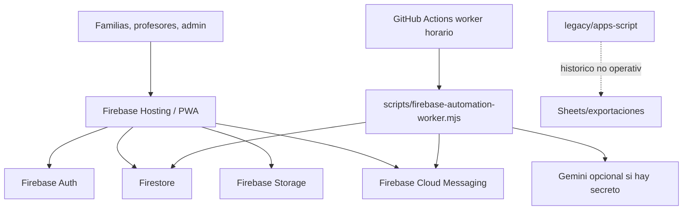

# Arquitectura - ClasesDe10

Actualizado: 2026-07-07

## Resumen

ClasesDe10 queda como una aplicacion web estatica/PWA servida por Firebase
Hosting y apoyada en Firebase Spark para Auth, Firestore, Storage y FCM. No hay
Cloud Functions desplegadas ni objetivo de despliegue `functions` en
`firebase.json`.

La ejecucion de fondo que antes se planteo con Cloud Functions se ejecuta ahora
desde GitHub Actions mediante `scripts/firebase-automation-worker.mjs`. El worker
usa Firebase Admin SDK y motores compartidos de `functions/`, pero esa carpeta
no es un paquete desplegable de Firebase Functions.

## Diagrama logico

## Servicios activos

| Dominio | Tecnologia actual | Coste |
| --- | --- | --- |
| Hosting web/PWA | Firebase Hosting Spark | 0 EUR dentro de cuota gratuita |
| Identidad | Firebase Auth | 0 EUR dentro de cuota gratuita |
| Datos | Firestore | 0 EUR dentro de cuota gratuita |
| Documentos | Firebase Storage | 0 EUR dentro de cuota gratuita |
| Push | Firebase Cloud Messaging | 0 EUR |
| Automatizaciones | GitHub Actions + Firebase Admin SDK | 0 EUR dentro de cuota gratuita |
| IA | Gemini opcional por secreto | Desactivable; determinista si no hay clave |

## Servicios no operativos

- Firebase Cloud Functions: no se despliega; requeriria Blaze para el deploy.
- Supabase: no es dependencia runtime real. `js/supabase-client.js` exporta la
  capa de compatibilidad Firebase para no reescribir de golpe todos los paneles.
- Apps Script/Sheets: archivado en `legacy/` y `migration-private/`, sin papel
  operativo.
- Netlify: no es la produccion canonica actual.

## Flujos principales

1. Usuario inicia sesion con Firebase Auth.
2. El panel lee/escribe Firestore mediante `js/firebase-data-client.js`.
3. Los documentos se suben a Firebase Storage con reglas privadas.
4. Las clases, pagos, justificantes, incidencias y notificaciones quedan en
   Firestore.
5. El worker de GitHub Actions barre cada hora los hitos criticos: clases sin
   marcar, pagos vencidos, justificantes, incidencias, push y jobs pendientes.
6. El barrido nocturno ejecuta tareas completas de confianza, analitica,
   supervision y metricas.

## Principios

- Coste de infraestructura objetivo: 0 EUR.
- Nada que requiera Blaze puede ser parte obligatoria de produccion.
- Las reglas de seguridad viven en Firebase Rules, no en el cliente.
- Los nombres `supabase-*` que quedan en runtime son compatibilidad de API,
  no dependencia real de Supabase.
- Las automatizaciones deben ser idempotentes y deduplicadas porque se ejecutan
  por barrido, no por trigger instantaneo.
- Todo cambio estructural debe mantener verdes `audit:free-infrastructure`,
  `audit:production-readiness` y `check:automation`.
