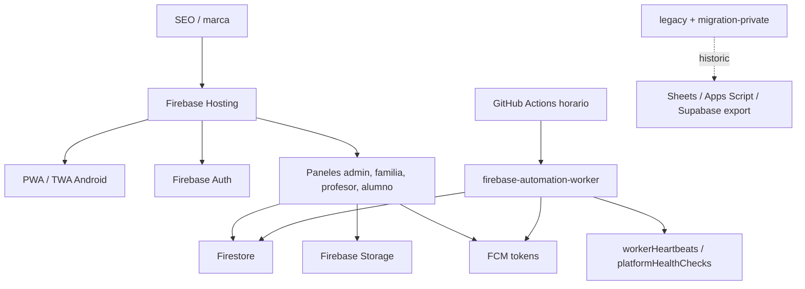

# Mapa del sistema - ClasesDe10

Actualizado: 2026-07-07

## Mapa logico

## Mapa de carpetas

| Ruta | Papel |
| --- | --- |
| `/web` | App activa publicable |
| `/web/pages` | Login y paneles |
| `/web/js` | Motores, adaptadores Firebase y UI |
| `/web/css` | Estilos publicos y dashboard |
| `/web/firebase` | Rules e indices |
| `/web/functions` | Motores compartidos, no deploy target |
| `/web/scripts` | Tests, auditorias y worker |
| `/web/android` | TWA/APK |
| `/web/supabase` | Referencia historica de migracion |
| `/legacy/apps-script` | Apps Script archivado |
| `/migration-private` | Datos privados de migracion/credenciales locales |

## Flujos vivos

| Flujo | Entrada | Proceso | Salida |
| --- | --- | --- | --- |
| Login | Firebase Auth | `auth-provider` | Panel por rol |
| Clase | Familia/profesor/admin | Firestore + calendario | Clase visible en paneles |
| Clase recurrente | Propuesta aceptada | Materializacion/sync | Clases semanales en calendario |
| Pago familia | Dia de pago | Justificante + validacion admin | Clases pagadas/no pagadas |
| Cobro profesor | Clases dadas | Calculo proporcional | Payout admin-profesor |
| Notificacion | Motor/worker | Dedupe + prioridad | Firestore + push |
| Incidencia | App/worker/admin | Clasificacion y sugerencias | Resolucion asistida |

## Contratos criticos

- No desplegar Cloud Functions.
- No activar Blaze para funcionalidades obligatorias.
- No crear nuevas dependencias Supabase/App Script.
- No cachear paneles privados en service worker.
- Mantener `audit:free-infrastructure`, `audit:production-readiness` y
  `check:automation` en verde.
